# 墙裂购买使用教程

墙裂可以说是目前全网最便宜最稳最快的V2ray机场了，现在带大家一起购买使用。

不多说先来看下套餐，注意CNY是人民币的意思，是不是很便宜？

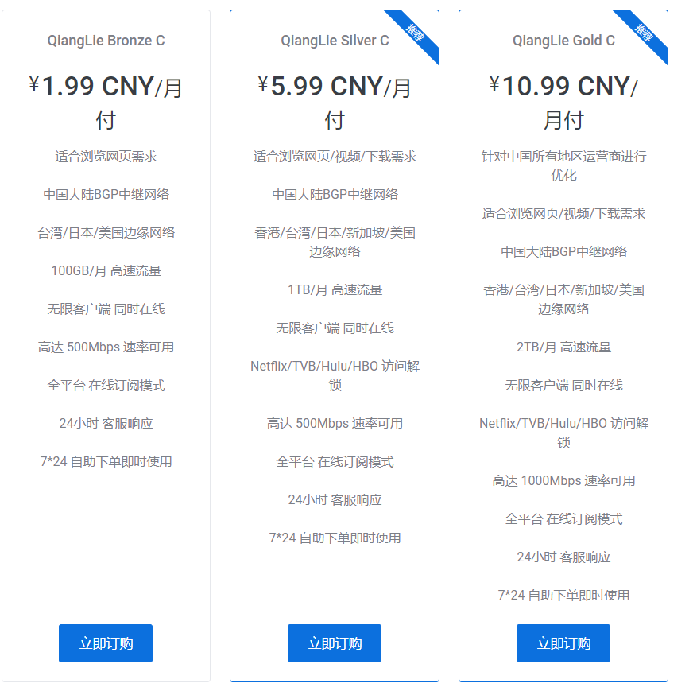

## 注册账号
我们建议您先注册账号后再购买：[点我前往注册页注册](https://aff.qianglie.org/aff.php?aff=627)

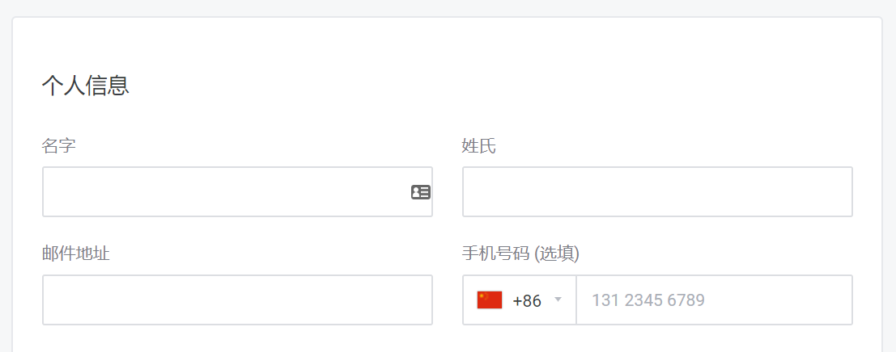
名字、姓氏、邮件地址必填，手机号码选填（可以不填写），邮件地址请填写您的邮箱。
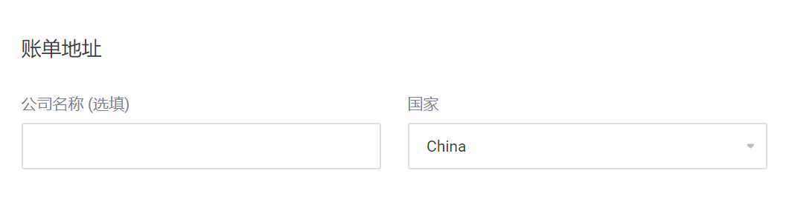

公司名称选填（可以不填写），国家默认不改。

填写密码，建议开启“订阅我们的邮件”，输入验证码后点击注册，跳转后注册成功。

## 购买服务
服务购买地址：[点我前往套餐页购买](https://aff.qianglie.org/aff.php?aff=627)

选择您符合您需求的套餐，点击“立即订购”。

跳转至套餐配置页面，选择您需要的付款周期，点击“继续”跳转至确认信息页。
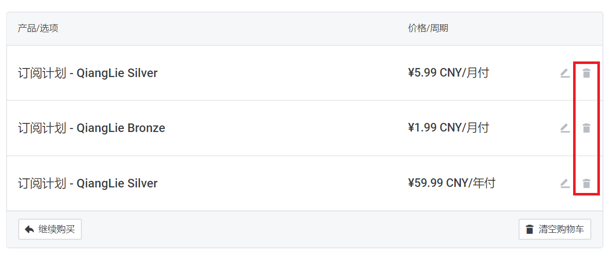

如果您选择了多个产品，只想购买其中的一款，可以点击右边红框中的任一按钮删除对应产品。
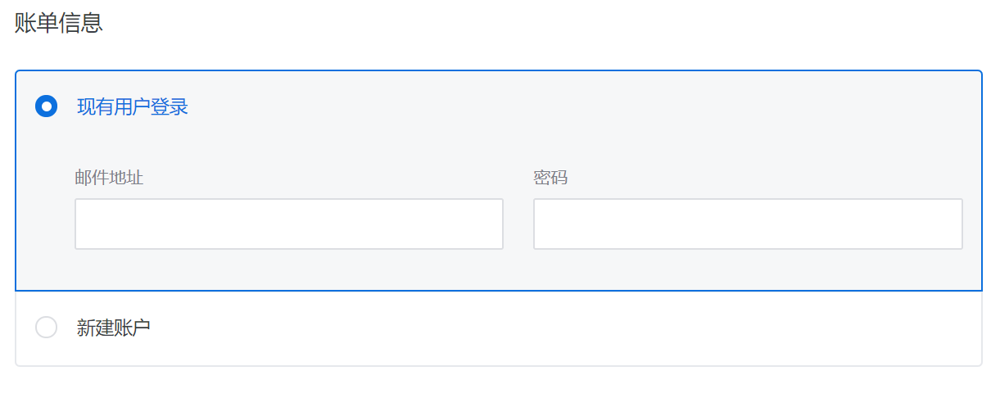

如果您按教程已经注册点击“现有用户登录”，填入您的邮箱和密码。

若您尚未注册，点击新建账户，根据本教程<注册账号部分>填写。

选择“付款方式”，默认即可。

点击“结账”，跳转至账单页面，打开支付宝扫描二维码进行支付（手机浏览器或二维码显示不全无法扫描，请长按二维码图片保存，打开支付宝扫码，导入二维码图片进行付款），若无法显示二维码请提交工单。

如果支付宝扫码后提示额度不够，请关闭代理，关闭支付宝后重新打开支付宝付款，若还是无法付款请提交工单。

## 墙裂客户端设置教程 – Windows
客户端下载
[Clash](https://git.io/fjyhN)

### 配置 – Clash

登陆我们的网站，执行下列操作：

单击 “产品服务” > “我的服务” > 选择 “你可用的产品/服务”。
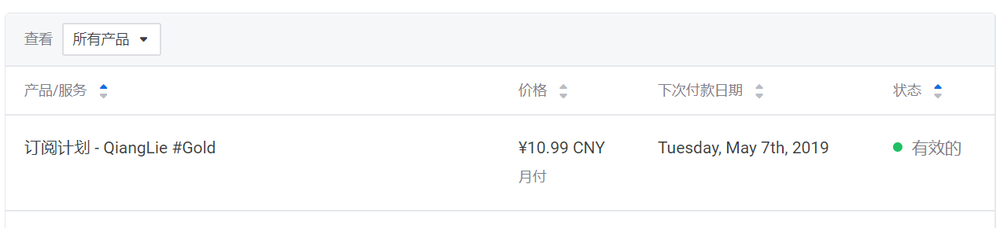

点击 “Clash” 右边绿色的按钮 “复制”。
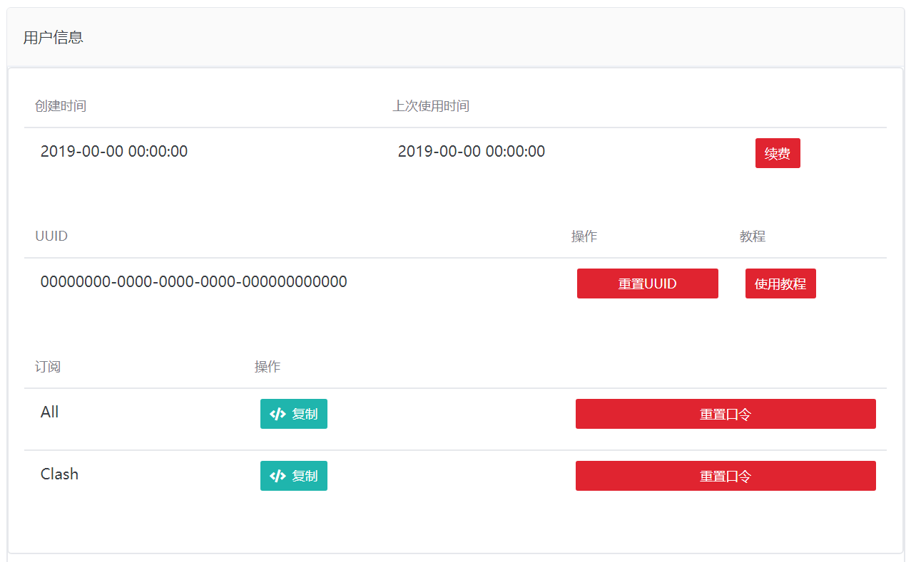

Clash 的设置过程：
安装客户端后，点击 “Profiles”。
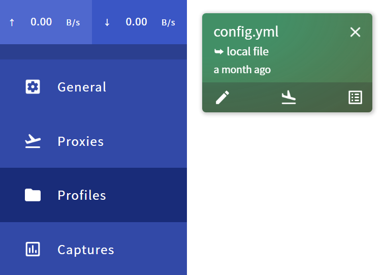

在 “Download from a URL” 粘贴刚才复制的托管地址，然后点击 “Download”。

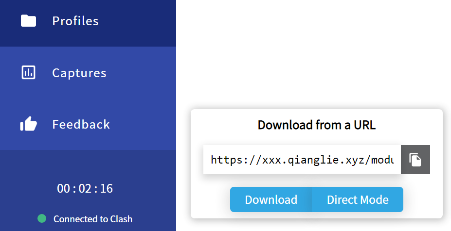
自动下载托管配置，若下载不成功请检查网络。
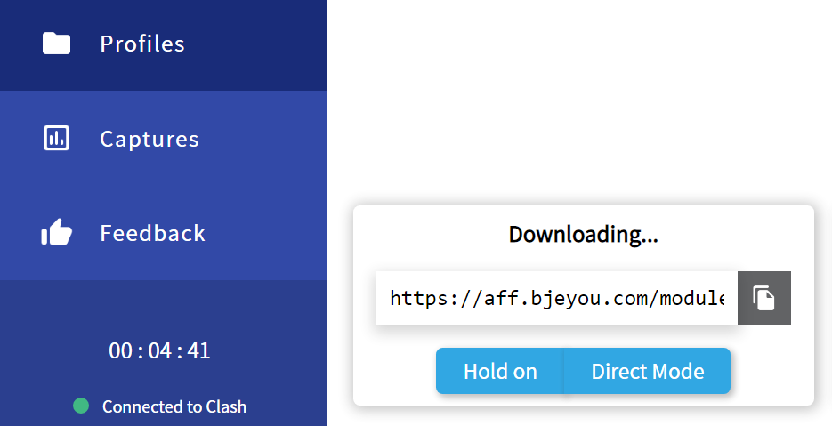

显示 “Success!” 则下载成功。
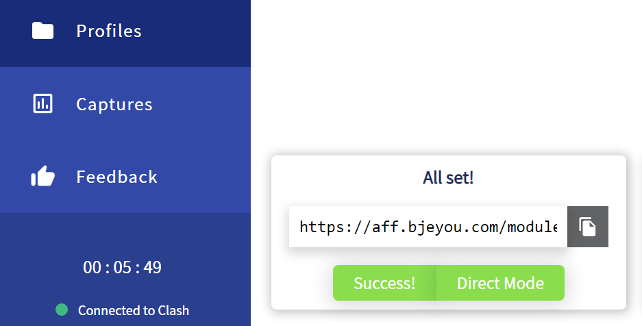

前往 “General”，选择 “System Proxy” 开启系统代理。
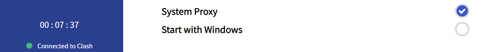

前往 “Proxies”，选择 “Global” 模式，选择您心仪的节点即可畅游网络！

如果您了解如何使用 “Rule” 模式，我们推荐您使用该模式，节省流量。

>如果发现配置好 Clash 之后无任何错误信息，但是依旧不能浏览谷歌等网站，请检查本地时>间与北京时间的误差，v2ray 要求误差不超过2分钟，可以通过同步时间或者修改本地时间为北京时间在尝试。

其他客户端使用方法同V2ray的使用方法，篇幅有限就不展开了。