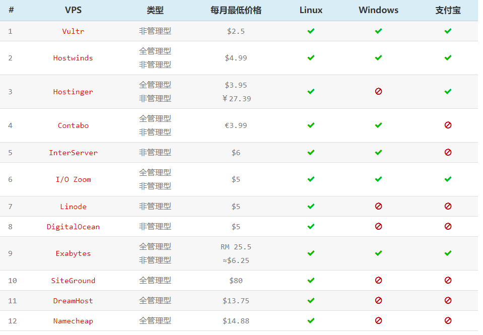

## VPS购买建议

## 买前建议

1. 不要一味追求价格低，应选择大厂。

原因：低价往往意味着低质，低价也往往出现在小商家那里，同样的，售后没有保证，跑路风险大。价格方面，适中即可。

2. 建议选择的VPS商家后台，支持用户自主操作更换IP址。

原因：使用过程中，有一定的机率会被GFW墙掉IP，目前少数VPS商家支持这一功能。另外有部分商家，支持与客服沟通后付费换IP

3. 建议选择的VPS商家后台，支持用户自主更换机房。

原因：国外各机房分布在世界各地，线路错综复杂，与国内连接可能会时好时坏。在连接状况差的情况下，自主换到另外一个机房，这样会非常方便。

4. 选择VPS配置时，内存选多大合适？

推荐512M或1G起步。

5. 购买VPS时，选择OpenVZ类还是KVM类？

推荐KVM，相比OpenVZ有明显优势，可以在一定程度上避免严重超售，并且可以很方便的安装BBR加速。

6. 购买VPS时，应该选择安装什么系统？

推荐CentOS 6 或Debian 8 以上，网上各种一键脚本适配起来更加方便。

##  推荐的VPS商家(排名不分先后)

### 1.搬瓦工

搬瓦工符合我们以上所提的各项条件，其优势在于稳定、线路好，可以买到性价比较高的洛杉矶CN2 GIA线路，国内连接速度快。另外也提供香港机房VPS，国内连接速度更快。

搬瓦工的各VPS套餐，在使用优惠码后更加便宜，性价比极高，支持支付宝（Alipay）付款。

搬瓦工优惠码：

6.25%优惠码：| 5.97%优惠码 |5.5%优惠码
---|---|---
BWH126FXH3HIQ | BWH125AQH2CMQ |ireall1yreadtheterms8

[进入官网](https://bwh88.net)

搬瓦工教程：

[搬瓦工VPS服务器购买及使用教程](https://www.cccitu.com/4018.html)

 

### 2.Vultr

Vultr也满足以上各项条件，有美国洛杉矶、日本、新加坡等机房供选择，支持支付宝（Alipay）付款，月付最低仅2.5美元（仅IPv6）。并且可以按小时付费，非常灵活。

Vultr目前没有发行优惠码。

[进入官网](https://www.vultr.com/)

Vultr教程：

[Vultr VPS服务器购买及使用教程](https://www.cccitu.com/166.html)

另外你可以参考这篇文章[2019年最好的国外VPS推荐](https://www.10besty.com/best-vps-hosting-services/)

* 非管理型（Unmanaged）VPS相当于一台裸机，只提供一个原生操作系统，所有的软件都需要你自己安装。这种VPS适合专业的开发人员，拥有很高的自由度。
* 全管理型（Managed）VPS已经安装好了各种建站软件，只需在后台点几个按钮就可以建好一个网站。这种VPS适合不懂程序开发的站长，好处是你可以专注于自己的业务，托管商帮你解决一切技术问题；但缺点也很明显：基本上只能用来建设网站。

参考链接：
1. https://ssr.tools/55
